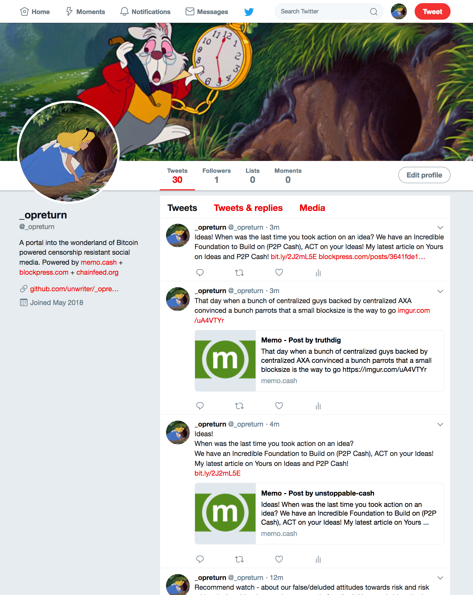

# _opreturn

[@_opreturn](https://twitter.com/_opreturn)

A portal into the wonderland of Bitcoin powered censorship resistant social media. Powered by http://memo.cash  + http://blockpress.com  + http://chainfeed.org

# What

`_opreturn` is a Twitter bot that utilizes the [chainfeed firehose API](https://chainfeed.org/api) to monitor realtime messages from Bitcoin cash powered social media protocols such as memo.cash and blockpress.com, and replicate them to Twitter using Twitter's API.

We're turning Twitter into an application-specific Bitcoin sidechain.

# How

[chainfeed API](https://chainfeed.org/api) lets you listen to all realtime mempool `OP_RETURN` transactions from Bitcoin Cash blockchain through a method called `listen`.

This method returns ALL `OP_RETURN` transactions through its callback but for this app we filter the stream down to just "post a message" actions for the protocols.

# Why

There can be many powerful use cases, but it all comes down to the fact that for the first time we have a portal from an uncensorable media into a censorable media. Use your imagination.

For example, if your Twitter account gets banned, shadowbanned, or hijacked, you can still express yourself outside of Twitter through censorship resistant social media such as memo.cash and blockpress, and they will be brought back into Twitter-verse and heard by others who care (who follow this account).

# Policy

With great power comes great responsibility. There are certain things `_opreturn` does in order to stay alive as long as possible (read: not banned by Twitter).

1. No `@` mentions: The bot replaces all mentions with `$`. We don't want the bot to harrass other Twitter users with mention notifications and get banned.
2. No media posts: Media specific posts are not replicated because it may trigger an "offensive content" ban.

